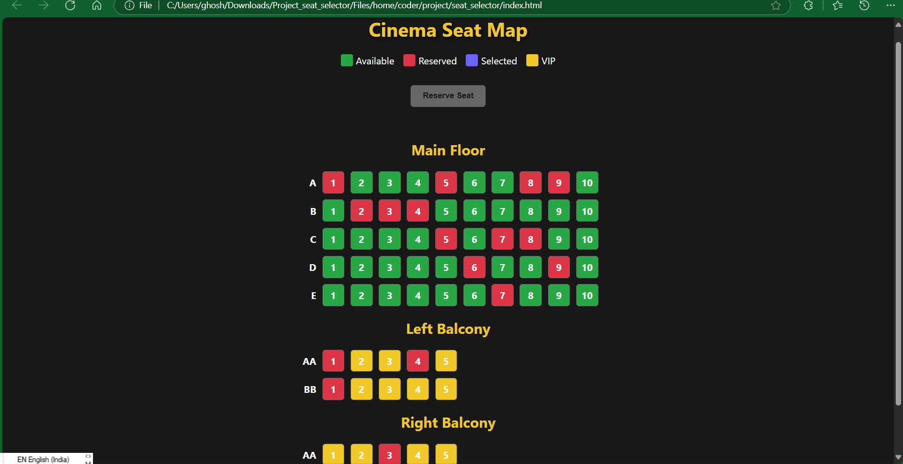
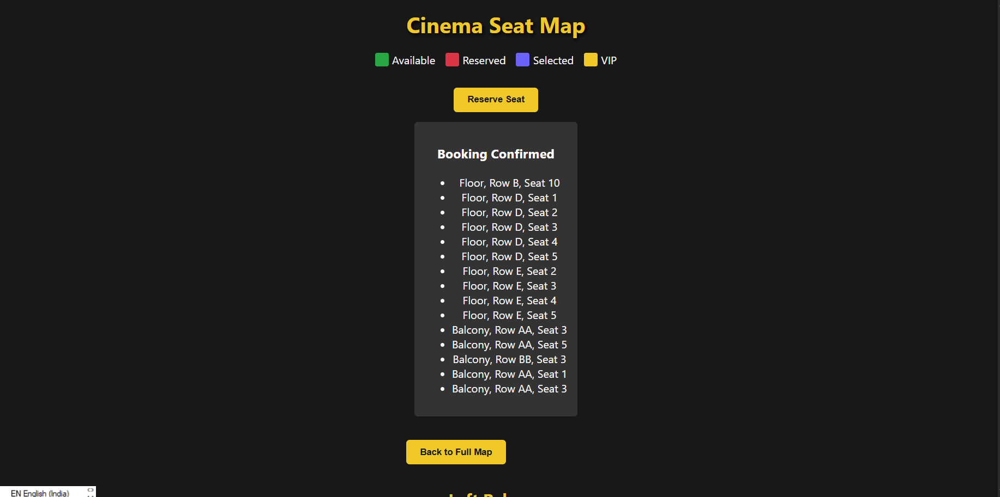

# Seat Selector Web App

This is a web application built as part of a Coursera lab project. It allows users to select seats from different sections (e.g., Main Floor, Left Balcony, Right Balcony) using HTML, CSS, and JavaScript. The project demonstrates front-end development skills, including DOM manipulation and event handling.

## Summary

This project is a seat selector web application developed as part of a Coursera lab, designed to allow users to interactively choose seats across sections like Main Floor, Left Balcony, and Right Balcony. Built using HTML, CSS, and JavaScript, this work demonstrates my ability to create functional and user-friendly front-end solutions. It stands out by leveraging jQuery for enhanced interactivity and offering a visually appealing interface, making it a practical tool for event seating management or similar applications.

## Solution

The seat selector web app offers a dynamic interface where users can select seats with a single click, powered by a combination of HTML for structure, CSS for responsive styling, and JavaScript with jQuery for real-time interactivity. The `seat.js` file handles section-specific logic, ensuring a smooth user experience. This solution could benefit businesses like theaters or event venues by streamlining seat allocation, reducing manual errors, and improving customer satisfaction through an intuitive online tool.

## Approach

To build the seat selector app, I started by designing the layout in `index.html`, dividing the interface into sections (Main Floor, Left Balcony, Right Balcony) based on the project requirements. I then used `style.css` to create a responsive and visually appealing design, ensuring sections were distinguishable and user-friendly. For functionality, I implemented `script.js` to manage general interactivity and integrated jQuery (via CDN) to enhance DOM manipulation. The core logic was developed in `seat.js`, where I added event listeners to handle seat selection and updated the UI dynamically. I tested the app locally by opening `index.html` in a browser, debugging issues like broken links, and iterating based on the observed behavior to ensure reliability. This structured approach allowed me to balance aesthetics and functionality effectively.

## Files

- `index.html`: The main HTML structure of the seat selector interface.
- `style.css`: CSS file for styling the layout and sections.
- `script.js`: JavaScript file for general interactivity and logic.
- `seat.js`: JavaScript file handling the seat selection functionality, including section-specific logic.

## Screenshot

